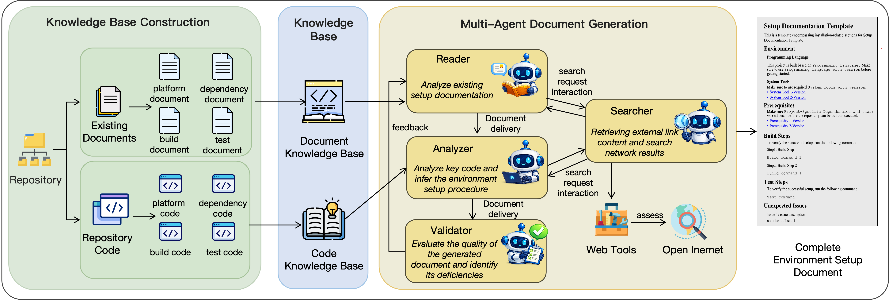

# You Run It: Completing Repository Documentation for Automated Environment Setup

A PyTorch Implementation of ASE submission “You Run It: Completing Repository Documentation for Automated Environment Setup”


## Introduction
Automated environment setup aims to generate ready-to-use development environments for code repositories fully automatically. Existing methods rely on repository documentation (e.g., README) as the main source for extracting environment setup information, including dependencies, build commands, test scripts, and other details. However, real-world repository documentation is often incomplete, posing substantial challenges for these approaches. To systematically study this issue, we construct DocLessBench, a benchmark of real-world code repositories with incomplete documentation, spanning five widely used programming languages. Using DocLessBench to evaluate existing methods, we find that they perform poorly in incomplete documentation scenarios. To address this limitation, we propose EnvDocAgent, a multi-agent framework that automatically analyzes available documentation and key code artifacts in the repository to generate a complete environment setup document. Our evaluation demonstrates that the documents generated by EnvDocAgent can effectively improve the performance of automated environment setup methods on repositories with incomplete documentation. Compared with the state-of-the-art document generation method, EnvDocAgent increases the number of successfully built and tested repositories by 77.3\% and 104.7\%, respectively, while also reducing the time and monetary costs of environment setup by 37\% and 43.5\%, respectively.

## Folder Structure

Here we list the descriptions of the folders:


* DocLessBench: Repositories in DocLessBench, their URLs, and labels.
* EnvDocAgent: the code for EnvDocAgent.
* Ablation_study: the code for Ablation_study.
* Results: the documents generated by EnvDocAgent for repositories in DocLessBench


# DocLessBench

We first introduce DocLessBench, a benchmark for studying automated environment setup under incomplete repository documentation. It contains real-world repositories whose setup-related documentation is incomplete, making them challenging for automated environment setup methods and LLM-based agents.

## Bench Files

DocLessBench organizes repositories by programming language and provides two types of CSV files for each language:

1. **Repository list files**  
   These files contain the repositories collected for each programming language.

2. **Repository list files with documentation-issue labels**  
   These files additionally annotate each repository with one or more documentation incompleteness issue types.

Currently, the benchmark includes the following language-specific files:

- `java.csv`
- `python.csv`
- `c.csv`
- `c++.csv`
- `Javascript.csv`

and their labeled counterparts:

- `javawithlabel.csv`
- `pythonwithlabel.csv`
- `cwithlabel.csv`
- `c++withlabel.csv`
- `Javascriptwithlabel.csv`

## Benchmark Statistics

DocLessBench contains **200 real-world repositories** collected from five programming languages:

- Java: 40
- Python: 40
- C: 40
- C++: 40
- JavaScript: 40

In addition to language-level grouping, DocLessBench also annotates repositories with five types of documentation incompleteness issues:

- Missing Dependency: 89
- Missing Version: 41
- Missing Build: 61
- Missing Test: 80
- External Content: 67

Statistics Table

| Language | Project Count | Missing Dependency | Missing Version | Missing Build | Missing Test | External Content |
|----------|----------------|-------------------|-----------------|---------------|--------------|------------------|
| Java | 40 | 9 | 5 | 7 | 20 | 10 |
| Python | 40 | 22 | 10 | 16 | 19 | 27 |
| C | 40 | 23 | 7 | 21 | 16 | 10 |
| C++ | 40 | 19 | 10 | 13 | 15 | 13 |
| JavaScript | 40 | 16 | 9 | 4 | 10 | 7 |
| Total | 200 | 89 | 41 | 61 |80 | 67 |

# EnvDocAgent
We then introduce EnvDocAgent, a multi-agent framework designed to generate complete environment setup documents for repositories with incomplete documentation.

## How EnvDocAgent Works

1. **Knowledge base construction:** EnvDocAgent first collects setup-related repository documentation and key code artifacts, and organizes them into a **document knowledge base** and a **code knowledge base**. The knowledge base is structured around four setup aspects: **platform**, **prerequisites**, **build**, and **test**. External links referenced in repository documents can also be retrieved when needed.

2. **Initial document generation:** The **Reader** agent analyzes the document knowledge base and produces an initial environment setup document following the predefined template. At the same time, it identifies missing setup information that cannot be recovered from the repository documentation alone.

3. **Document completion:** The **Analyzer** agent examines the code knowledge base to infer missing setup details, such as platform requirements, dependencies, build steps, and test procedures, and then supplements the initial document. When the repository documentation depends on external resources, the **Retriever** agent follows external links or performs online retrieval to gather additional setup information.

4. **Iterative validation and refinement:** The **Validator** agent evaluates the generated document, reports remaining issues, and provides feedback to guide the next round of revision. The agents continue refining the document until it is considered complete or the maximum number of rounds is reached.

<div align=center></div>
   
## Requirements

- **Python 3.10+** (recommended)
- **Git** (for cloning)
- At least one configured **LLM backend** (OpenAI-compatible, Azure OpenAI, AWS Bedrock, or Anthropic)

## Quick start

```bash
git clone <this-repo>
cd EnvDocAgent
pip install -r requirements.txt
cp env.example .env
# Edit .env: set API keys, model, and LLM_PROVIDER
python3 main.py https://github.com/owner/repo
```

## LLM configuration

EnvDocAgent loads its configuration from EnvDocAgent/.env. To configure EnvDocAgent, users can fill in or modify the variables defined in this file.

### Compatible with multiple LLM APIs (API key + optional base URL)

Compatible with multiple LLM APIs (API key + optional base URL)
EnvDocAgent supports multiple LLM APIs, including GPT-5, Claude-4.5, and Gemini-3-Pro. Users can enable a target model by configuring its API key and an optional base URL. GPT-5 is taken as an example below.

```bash
LLM_PROVIDER=openai
OPENAI_API_KEY=your_key
OPENAI_BASE_URL=your_url
OPENAI_MODEL=gpt-5
```

## RQ1:The effectiveness of EnvDocAgent

### Single repository

```bash
python3 main.py https://github.com/owner/repo
python3 main.py https://github.com/owner/repo --ref develop
python3 main.py https://github.com/owner/repo --github-token ghp_xxx
python3 main.py https://github.com/owner/repo --max-rounds 8 --disable-external-fetch
```

### Batch (one URL per line)

```bash
python3 main.py --batch github_links.txt
python3 main.py --batch repos.txt --output-dir ./batch_runs
```

Lines starting with `#` and blank lines are skipped. URLs must be `https://github.com/...` (or `http://`).

## CLI reference

| Option | Description |
|--------|-------------|
| `repo_url` | GitHub URL (single-repo mode; omit when using `--batch`) |
| `--batch FILE` | Read multiple repo URLs from a file |
| `--ref` | Branch, tag, or commit (clone ref) |
| `--github-token` | GitHub token (overrides `GITHUB_TOKEN` in `.env` if passed) |
| `--enable-external-fetch` / `--disable-external-fetch` | Toggle Retriever-style external link fetching (default: enabled in config) |
| `--max-rounds` | Maximum number of iterative rounds (default: `DEFAULT_MAX_ROUNDS` in `.env`, **8**) |
| `--output-dir` | In batch mode: directory for **`batch_report.txt`**. Per-repo artifacts still use `OUTPUT_DIR` from `.env` unless you align them. |
| `--log-dir` | Log directory (default: `logs`) |
| `--log-level` | `DEBUG` … `CRITICAL` |


## RQ2: Cost analysis

When generating complete setup documentation for repositories, EnvDocAgent also records the time cost and monetary cost incurred during the generation process.

### Single repository

```bash
python3 main.py https://github.com/owner/repo
python3 main.py https://github.com/owner/repo --ref develop
python3 main.py https://github.com/owner/repo --github-token ghp_xxx
python3 main.py https://github.com/owner/repo --max-rounds 5 --disable-external-fetch
```

### Batch (one URL per line)

```bash
python3 main.py --batch github_links.txt
python3 main.py --batch repos.txt --output-dir ./batch_runs
```
## RQ3: Ablation Study 

In the ablation experiment, we start with the full approach, then remove each of the four agents and observe the results after removal.

### (1)w/o Reader

This variant removes the Reader agent. As a result, the framework can no longer generate an initial environment setup document from the existing repository documentation, and thus cannot fully utilize explicitly documented setup information. Ablation_study/remove_reader stores the implementation of the variant without the Reader agent. Its execution process is the same as that used in RQ1.

### (2)w/o Analyzer

This variant removes the Analyzer agent. Without code-level analysis of key repository artifacts, the framework cannot effectively recover missing setup information such as dependencies, build procedures, and test steps. Ablation_study/remove_analyzer stores the implementation of the variant without the Analyzer agent. Its execution process is the same as that used in RQ1.

### (3)w/o Retriever

This variant removes the Retriever agent. Consequently, the framework can no longer access setup-related information from external links referenced in the repository documentation or perform additional online retrieval when such information is missing. Ablation_study/remove_retriever stores the implementation of the variant without the Retriever agent. Its execution process is the same as that used in RQ1.


### (4)w/o Validator

This variant removes the Validator agent. Without document quality assessment and iterative feedback, the framework loses its ability to refine the generated setup document in a controlled manner, which may reduce the overall completeness and reliability of the final document. Ablation_study/remove_validator stores the implementation of the variant without the Validator agent. Its execution process is the same as that used in RQ1.


